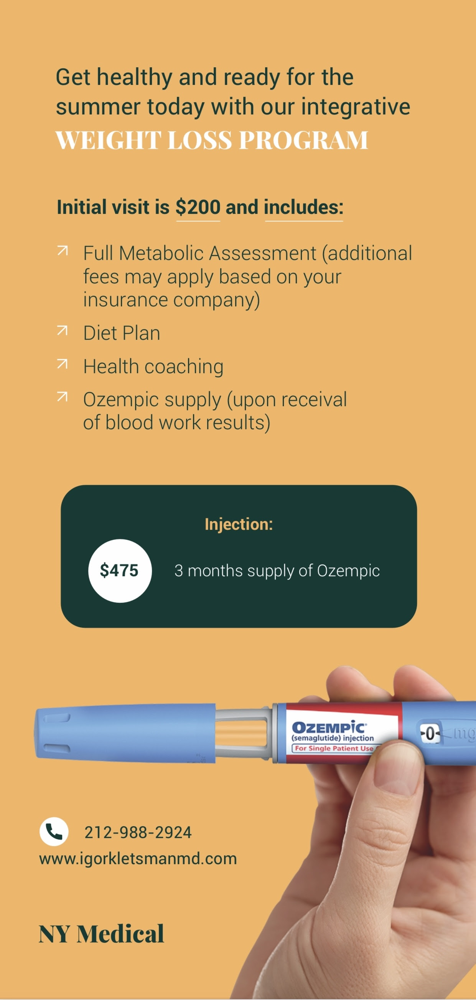
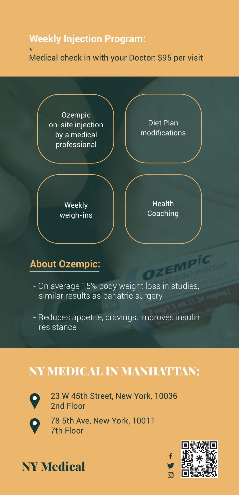

We're sure that at this point you've already heard of OZEMPIC and how effective it is for weight loss. 

Ozempic is not covered by inusrance companies for weight loss and prices at retail pharmacies are prohibitive running at approximately $1200 a month.

NY MEDICAL has been able to secure a significantly lower price for our patients and we are happy to offer it to you today.

Get Healthy And Ready For The Summer Today With Our Integrative Weight Loss Program

Initial visit is $200 and includes:

\-Full Metabolic Assessment (additional fees may apply based on your insurance company)

\-Diet Plan

\-Health Coaching

\-Ozempic supply (upon receival of blood work results)

  

Ozempic:

3 months supply of Ozempic - $475 

Injection Program: $95 per week

\-Medical check in with your provider

\-Weekly weigh-ins 

\-Health Coaching

\-Ozempic on-site injection by a medical professional

\-Diet Plan modifications

About Ozempic:

\-On average 15% body weight loss in studies, similar results as bariatric surgery

\-Reduces appetite, cravings, improves insulin resistance

  

Need more info? 

You can schedule your appointment to discuss the program with one of our Doctors today!

  

Yours Truly,

NY MEDICAL

212-988-2924

