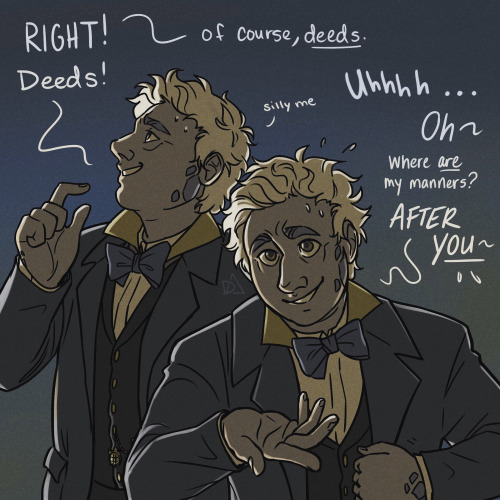

### Chapter Text 章节正文

They are in a garden. The first garden ever, actually. He had been sneaking around so carefully, but when your animal aspect is as large and lumbering as his, it's tough to be stealthy. So when a clearing opened up to reveal the guardian of Eden, he'd expected opposition, or at least interrogation. Instead, the large demon tortoise finds a very relaxed angel leaning against an outcropping. The reclining figure observes the tortoise and dips his head of long red curls once in acknowledgement. He knew all the animals in Eden. This wasn't one of them.  
他们在一个花园里。实际上，这是第一个花园。他一直小心翼翼地潜行，但当你的动物本性像他这样庞大而笨重时，要偷偷摸摸就很困难。所以当一个空地出现，揭示出伊甸园的守护者时，他预料到会遭到反对，或者至少会被盘问。然而，这只巨大的恶魔乌龟却发现一个非常放松的天使靠在一块突出的岩石上。躺着的人物观察着乌龟，轻轻点头示意。他认识伊甸园里的所有动物，而这只乌龟不是其中之一。

The galapagos-looking creature almost keeps moving towards where he can hear the humans bumbling about, but pauses, confused.  
那个看起来像加拉帕戈斯动物的生物几乎要朝着能听到人类胡乱说话的地方移动，但停下来，感到困惑。

“Aren’t you... going to stop me?”  
你难道不打算...阻止我吗？

The angel looks at him, equally confused, “... am i supposed to?”  
天使看着他，同样困惑地说道：“...我应该吗？”

The demon transforms into his humanoid form. One that was... oddly familiar, but with a scale or two here and there. Dusty blonde hair with dirty roots. The eyes are off. As the angel is not being particularly threatening, the demon reclines slightly as well, flumping over onto an elbow in the grass and letting his wings flutter out. The angel tenses slightly, but doesn't do anything.  
恶魔变成了他的人形。一个...奇怪地熟悉的形象，但身上有一两片鳞片。灰尘般的金发，根部肮脏。眼睛有些不对劲。由于天使并没有表现出威胁，恶魔也稍微放松下来，倚靠在草地上的一只手肘上，让他的翅膀轻轻扇动。天使微微紧张了一下，但没有做任何事情。

“I kind of figured...?” he trails off, not sure what he figured the guardian of Eden would do, and not wanting to cause insult. His expectations hadn't accounted for this lack of hostility.  
“我有点猜到了……？”他停顿了一下，不确定自己猜到伊甸园的守护者会做什么，也不想冒犯。他的期望没有考虑到这种缺乏敌意。

“Well... I won’t tell if you won’t.” The angel doesn't move other than to smile conspiratorially, trying his best to continue looking relaxed as his mind races. Something unlocks.  
“嗯...如果你不说，我也不会说。”天使除了微笑共谋地不动外，尽力保持放松的样子，心中却在飞速思考。某种东西解开了。

The demon putters and grins. “Oh good. Truth be told, I’m a little nervous. First big assignment and all.”  
恶魔咯咯地笑着说：“哦，太好了。说实话，我有点紧张。这是我第一次大任务。”

“I didn’t know demons _could_ feel nervous. Is that just your thing, or...”  
我不知道恶魔也会感到紧张。这只是你的特点，还是...

Were all angels this conversational? He couldn't remember, but his fellow demons certainly weren't. It was refreshing to hear full sentences, to be asked about himself.  
所有的天使都这么健谈吗？他记不清了，但他的同伴恶魔们肯定不是。听到完整的句子，被问及自己的感觉真是令人耳目一新。

“Ah, I’m afraid I’m quite unique in that regard... the others would think me daft if I told them.” The demon answers, curling inward a little self-consciously. The angel suspects the other demons would do a little more than pass silent judgement if they found out. He smiles despite himself, while he carefully stirs the surface of blurry, half-formed memories. Tiny ripples warble outwards.  
“啊，恐怕在这方面我是相当独特的……如果我告诉其他人，他们会认为我是疯子。” 恶魔回答道，略带自卑地稍微蜷缩了一下。天使怀疑其他恶魔们发现了这一点后，不仅会默默地评判他。他不禁微笑起来，同时小心地搅动着模糊、半成形的记忆表面。微小的涟漪向外扩散。

“Don’t worry, your secrets are safe with me, Azir—UH" he panics, voice pitching up and floundering “I mean... um... what’s your, what should i— "  
“别担心，你的秘密跟我说的话是安全的，阿兹尔——呃”他慌乱地说道，声音变高并且支吾着，“我是说...嗯...你的，我应该怎么说呢—”

“You know my name,” the demon cuts in. It isn’t accusatory, his voice is quiet and reverent. Shocked. There’s no question in it. “But how...”  
“你知道我的名字，”恶魔插话道。他的声音不带指责，而是平静而虔诚的。震惊。其中没有疑问。“但是...”

_How do you remember_ goes unspoken, and unanswered. The angel can’t say — won’t say. Those memories were forbidden, dangerous, tucked safely away... he hadn't meant—  
你如何记得那些未言说、未回答的事情。天使不能说，也不愿说。那些记忆是被禁止的，危险的，安全地藏在心底...他并不是有意的-

He shouldn’t remember, but he does anyway.  
他不应该记得，但他还是记得。

“Did,” the demon gulps and his voice is almost timid, “..._do_ you know me?”  
“你，”恶魔咽了口水，声音几乎胆怯，“...你认识我吗？”

The angel looks away. Heaven doesn't know. Nobody knows. They _can't_. His mouth starts making vague noises of denial before his brain can catch up. Words tumble out of his mouth. _What of course not nobody remembers the ones that fell don't be ridiculous i have no idea what you're talking about etc_  
天使转过头去。天堂不知道。没人知道。他们不可能知道。他的嘴巴开始发出含糊的否认声，脑子还没反应过来。话从他的嘴里脱口而出。当然不是，没人记得那些掉下去的人，别荒谬了，我不知道你在说什么等等。

The angel squints warily at his companion, to see if any of the unconvincing lies have stuck. The air escapes his lungs at the sight of him. Tortoiseshell eyes shining, both familiar and unfamiliar, desperate and hopeful. Wanting. What must it be like, walking around feeling like something's been lost or forgotten, but never remembering enough of it to properly let it go?  
天使警惕地眯起眼睛看着他的伴侣，看看那些站不住脚的谎言是否有所保留。看到他，天使的呼吸一下子停止了。那双乌龟壳般的眼睛闪烁着，既熟悉又陌生，充满了绝望和希望。渴望着。像这样四处走动，感觉好像有什么东西丢失或被遗忘了，但又从未记住足够多的细节来真正放手，那是一种怎样的感觉呢？

"Listen... I don't know. I can't remember many details, I'm sorry... I can't--"  
听着...我不知道。我记不起太多细节，对不起...我不能--

"Say it." 说出来。

"What?" 什么？

"My real name. I want to hear it."  
我的真名字。我想听到它。

"I don't think that's..." _a good idea. going to help. what you need._  
我不认为那是一个好主意。不会有帮助。你需要的东西。

"Please," and there are those eyes again, "just tell me."  
“请，” 然后又是那双眼睛，“告诉我吧。”

The angel takes a deep breath, and then says the word like it’s been weighing down his tongue for centuries, like it’s his religion.  
天使深吸一口气，然后说出这个词，就像它已经压在他的舌头上几个世纪一样，就像它是他的信仰。

"Aziraphale." 阿齐拉费尔。

And they both hear the stark reality of it. Like flash paper.  
他们都听到了这个残酷的现实。就像闪光纸一样。

Azira _fell_. 阿齐拉摔倒了。

### Chapter Text 章节正文

Aziraphale had become caught up in the middle of an unfortunate altercation, that much was clear. He wasn’t a part of the regiment that had been ordered to march, but he also wasn’t a part of the group of angels who had gotten themselves just riled up enough to do something stupid, something loud and brash that could only end in tragedy. He wasn’t even where he was supposed to be (which was elsewhere), but what he _had_ done was nearly knock another angel down in his haste to get to his assigned post.  
亚齐拉费尔显然卷入了一场不幸的争执之中。他并不是被命令行军的那个队伍的一员，但他也不属于那群激动得足够愚蠢、喧闹而只会以悲剧收场的天使。他甚至不在他应该在的地方（其他地方），但他匆忙赶到指定岗位时，几乎撞倒了另一个天使。

The other angel had been distracted, eyes cast down as he ruminated on his own thoughts, and moving at quite a pace. Aziraphale, arms full of heavenly parchment and plans for the earth (which he was quite excited about), hadn’t seen him. They knocked into each other and tripped, limbs tangling. Scrolls scattered everywhere and they just barely kept from falling by grabbing onto each other.  
另一个天使心不在焉，低头沉思着自己的想法，快速地移动着。阿齐拉费尔满怀天堂的羊皮纸和地球的计划（他对此非常兴奋），没有看到他。他们相撞了，绊倒了，四肢纠缠在一起。卷轴散落一地，他们勉强通过互相抓住对方来避免摔倒。

“Oh, I am dreadfully sorry! How clumsy of me,” Aziraphale exclaimed, letting go once he had his balance. He reached for a few of the papers as he glanced at the face of the other angel. Fire-colored curls framed a face with wide golden eyes that blinked as his intense introspection was replaced with awareness.  
“哦，真是非常抱歉！我真是太笨了。”亚齐拉费尔失声道，一旦他恢复了平衡，他就松开了手。他伸手拿起几张纸，同时瞥了一眼另一个天使的脸。火红色的卷发围绕着一张拥有宽大金色眼睛的脸庞，当他的深思熟虑被意识所取代时，他的眼睛眨了眨。

“S’alright, I should have been paying attention,” he said, as he cast his gaze around to take in the scattered documents. “I’ll help you gather them up.”  
“没事，我应该注意的，”他说着，四处扫视着散落的文件。“我来帮你收拾。”

Aziraphale tutted and made a dismissive gesture with his free hand, unwilling to waste anymore of this angel’s time when he obviously had somewhere to be and something on his mind. “No, no, I’ll be fine, you go on.”  
亚齐拉费尔嘴里咂了一声，用空闲的手做了个不屑的手势，不愿再浪费这位天使的时间，因为显然他有事要做，心里也有事在想。“不，不，我没事，你去吧。”

“Are you sure?” 你确定吗？

“Positively.” Aziraphale already had most of them picked up, as they helpfully floated upwards so he wouldn't have to lean over. He cast a quick look over the angel, who still hesitated nearby with his hands slightly upturned. Hands that shimmered with stardust.  
“当然。”亚齐拉费尔已经把大部分书都捡起来了，因为它们乐意地向上飘起来，这样他就不必弯腰。他迅速扫了一眼那位天使，他仍在附近犹豫着，双手微微向上。那双手闪烁着星尘。

Aziraphale smiled, eyes crinkling. He did admire the makers and their imaginations. “I’m sure you have more important things to attend to. Don’t worry about me.”  
亚齐拉费尔微笑着，眼角皱纹展现出他的赞赏。他确实钦佩那些创作者和他们的想象力。“我相信你有更重要的事情要处理。不用担心我。”

The angel’s eyebrows furrowed slightly and he looked like he wanted to insist. A sharp voice cut across the two of them.  
天使的眉头微微皱起，看起来他似乎想要坚持。一道尖锐的声音打断了他们两个人的对话。

“There you are, Crawley!” Aziraphale was suddenly aware of a whole host of angels approaching, looking uncharacteristically irritated and determined.   
“克劳利，你在这儿！”阿齐拉费尔突然意识到一群天使正在接近，他们看起来异常烦躁和决绝。

The maker angel flinched and turned to face them as they got close. He cast a wary glance at Aziraphale out of the corner of his eye. Aziraphale just looked confused, not recognizing the not-very-angelic nickname. He opened his mouth to greet the approaching angels and ask what had them radiating with (_righteous?_ ) anger, but they were interrupted again by a loud trumpet that set his grace on edge. He couldn’t fathom why it was being sounded. It was unprecedented. It meant something terrible was happening. It was a call to action.  
制造天使感到不安，当他们靠近时，他转过身来面对他们。他斜眼瞥了一眼阿齐拉费尔，心生戒备。阿齐拉费尔只是一脸困惑，对这个不太像天使的绰号毫不知情。他张开嘴打算向接近的天使们问候，并询问他们为什么散发着（正义的？）愤怒，但他们又被一声大喇叭打断了，这让他的恩典感到紧张。他无法理解为什么会有这样的声音。这是前所未有的。它意味着发生了可怕的事情。这是一种行动的呼唤。

The angel in front of him (_Crawley?_ ) paled and went still. Aziraphale turned to face the sound, documents still in his hands, forgotten. There was a regiment of angels approaching. They were in formation, in uniform, as Aziraphale had never seen outside of mandatory drills. At the head of the angel ranks were the Archangels.   
他面前的天使（克劳利？）脸色苍白，一动不动。阿齐拉费尔转过身去，手中还拿着文件，已经被遗忘了。一队天使正在接近，他们整齐列队，穿着制服，这是阿齐拉费尔从未在强制演习之外见过的景象。在天使队伍的前头是大天使们。

A chill goes down Aziraphale’s spine and he frantically turns back to look at the others. He recognizes many of them. The angel that had spoken was high-ranking and beautiful.  Lucifer - one of God’s favored ones. He stares past Aziraphale for a moment, surprised, before his beautiful face twists into a snarl. Anger (_not righteous at all_, Aziraphale decides) rolls off of him in waves.  
一股寒意沿着阿齐拉费尔的脊椎传来，他疯狂地转身看向其他人。他认出了其中许多人。那个发言的天使地位高且美丽。路西法——上帝钟爱的其中之一。他目瞪口呆地盯着阿齐拉费尔片刻，然后他美丽的脸庞扭曲成了一抹咆哮。愤怒（阿齐拉费尔决定这根本不是正义的愤怒）从他身上散发出来。

“So be it,” he spits, and opens his mind.  
“就这样吧。”他咬牙切齿地说道，然后敞开心扉。

Aziraphale had often studied the plans for the humans. The ideas for the garden, for the paradise handmade for them, a new kind of being given a new kind of existence. The Almighty’s favorite idea of all: to make an animal in her own image and give it free will. _Completely corporeal, but clever and creative, and capable of their own kind of infinity._ He had absorbed all he could, enchanted by the idea. And he envied them. Just the smallest, tiniest bit of want that he tucked away in a remote fiber of his being. He used it to fuel a passion for God’s plan and his desire to make everything run as smoothly as possible.  
亚齐拉费尔经常研究人类的计划。为了他们而设计的花园，为了他们而手工制作的天堂，一种新的存在形式。全能者最喜欢的想法：创造一个以她自己的形象为蓝本，并赋予其自由意志的动物。完全有形，聪明而有创造力，能够拥有自己独特的无限可能。他尽可能地吸收了一切，被这个想法迷住了。他羡慕他们。只是一点点微小的渴望，他将它藏在自己内心的一个角落。他用它来激发对上帝计划的热情，以及他使一切尽可能顺利运行的愿望。

He feels that little bit of envy flare up unexpectedly as Lucifer calls to it. A silent battle cry to rival the sound of the trumpet. His followers, with no formation to speak of and hardened visages, all prepare themselves for the unthinkable: to defy God’s plan. The temptation to join in, to take, to have for himself, is almost overpowering. He looks at the assembled rebellion and then back at the angel he just met, whose golden eyes are full of regret and despair. Aziraphale is overwhelmed by an emotion he’s never felt before.

  
他感到一丝嫉妒在路西法的召唤下突然升腾起来。这是一声无声的战斗呐喊，可以与号角的声音相媲美。他的追随者们没有任何组织，他们的面容坚毅，他们都在为前所未有的事情做准备：违抗上帝的计划。加入其中，占有一切，为自己所用的诱惑几乎是无法抗拒的。他看着聚集起来的叛乱者，然后又看着刚刚认识的天使，那双金色的眼睛充满了遗憾和绝望。阿齐拉费尔被一种他从未有过的情感淹没。

_Sorrow.  悲伤。_

“Aziraphale! _Ruswan!”_ Gabriel’s voice booms as the regiment gets close. “Get out of the way.”  
“阿齐拉费尔！鲁斯万！”加百列的声音随着军队的接近而回荡。“让开。”

Ethereal energy is beginning to swirl around the angels, tugging on soft red curls and making the parchments flutter in Aziraphale's hands, so he lets them go. He can't look away from the shell-shocked angel. _Ruswan._  
飘渺的能量开始在天使周围旋转，拽动着柔软的红色卷发，让阿齐拉费尔手中的羊皮纸飘动起来，于是他放开了它们。他无法从那个震惊的天使身上移开目光。鲁斯万。

Lucifer growls, _"To me, Crawley,"_ and reaches out to grab his shoulder.  
路西法咆哮道：“过来，克劳利。”他伸手抓住了他的肩膀。

Aziraphale, small but strong, grabs the angel and bodily hauls him, throwing him out of the way of Lucifer’s grip. A member of the angel regiment grabs the maker and pulls him through the line before he can right himself, leaving no room for discussion. Ruswan finds himself in the air, headed away from the battle. As a delayed reaction, his wings flash open and he hauls back on the angel carrying him in blind panic. He watches as the floor of heaven falls open with thunderous crack, and the regimented forces shove both defeated and fighting rebels towards the great crevice as the two groups aggressively clash. The angel that saved him is smack in the middle of the chaos. _Aziraphale._  
阿齐拉费尔，虽然身材娇小但力量强大，紧紧抓住天使，将他一把拽开，躲过了路西法的控制。一个天使团队的成员抓住制造者，在他恢复平衡之前将他拉过了阵线，不给任何讨论的余地。鲁斯万发现自己被带离战斗，身体悬空。延迟的反应中，他的翅膀猛然展开，恐慌中他用力拉回抱着他的天使。他看着天堂的地面轰然破裂，整齐划一的军队将被击败和战斗中的叛乱者推向巨大的裂缝，两个团体激烈地交战。救了他的天使正好处于混乱的中心。阿齐拉费尔。

_They knew_, he thought bitterly. _Lucifer was so clever, he was so sure of himself, but he never saw this coming. A single command, that’s all it took._  
他们知道，他心里想着。路西法太聪明了，他对自己非常有信心，但他从未预料到这一点。只需要一个简单的命令，就足够了。

Makers weren’t expected to fight, but Aziraphale was. He dutifully draws his sword, even as the sorrow - swirling with pity, grief and wretched heartache - fills him completely. His grace warbles with the emotions and his vision blurs slightly. Many angels are already engaged in combat, but the fire on his sword doesn’t ignite, not until Michael glares briefly at him and then at the sword, fueling it with her own rage.   
制造者们并不被期望参与战斗，但阿齐拉费尔却是。他忠实地拔出剑，即使悲伤——伴随着怜悯、悲痛和痛苦的心碎——完全充斥着他。他的恩典因这些情感而颤动，视野稍微模糊。许多天使已经陷入战斗，但他的剑上的火焰并未点燃，直到迈克尔短暂地瞪了他一眼，然后瞪了剑一眼，用她自己的愤怒为其注入力量。

“Fight on behalf of the Almighty, Aziraphale!” She commands.  
“代表全能者而战，亚齐拉费尔！”她命令道。

The principality sways as he looks around. His hands tremble and he chokes out a sob.  
他环顾四周，公国摇摆不定。他的双手颤抖着，哽咽出一声啜泣。

“I _can’t."_ 我不能。

\_\_\_\_\_\_\_\_\_\_\_\_\_\_\_\_\_\_\_\_\_\_\_\_\_\_\_\_\_\_\_\_\_\_\_\_\_\_\_\_\_\_\_\_\_\_\_\_\_\_\_\_\_\_\_\_\_\_\_\_\_\_\_\_\_\_\_\_\_\_\_\_\_\_

“What do you mean you _can’t?”_ Azira asked, voice full of disbelief.   
“你是什么意思，你不能？” Azira问道，声音充满不可置信。

The angel shrugged. “I dunno. They told us it’s a demon thing. Nobody ever said why. Angels just… don’t turn into beasts.”  
天使耸了耸肩。“我不知道。他们告诉我们这是恶魔的事情。从来没有人说过为什么。天使就是……不会变成野兽。”

The demon smirked. “Not with _that_ attitude.”  
恶魔咧嘴一笑。“有这种态度可不行。”

“You know what I mean. I’ve never seen it happen, not once in all eternity.”  
你知道我在说什么。我从未见过这种事情发生，永远都没有。

“Have you ever tried?” 你试过吗？

“Have I _ever tried-_ oh- okay, yeah, let me just will my corporeal form into the shape of an animal. Just slither right on up to heaven and say ‘hey guys, look what I can do!’ I’m sure that would go over _great_.” The angel retorted, disparaging. “Trying new things is not exactly encouraged back home.”  
“我试过吗？哦，好吧，是的，让我把我的肉体变成动物的形状。就像蛇一样爬上天堂，然后说‘嘿，伙计们，看我能做什么！’我敢肯定那会非常受欢迎。”天使嘲讽地回答道，“在家里，尝试新事物并不被鼓励。”

“But it’s _fun._” “但这很有趣。”

“What, trying new things?”  
“什么，想尝试新事物？”

“No. Well, yes, but I meant taking on a different form,” Azira explained. “It’s fun.”  
“不，嗯，但是我是指以不同的形式出现，”阿齐拉解释道。“这很有趣。”

“Your animal aspect is a…” The angel snapped his fingers a few times, trying to remember the animal names Adam had only just invented a few days ago, “A turtle! Big shell, slow as anything-”  
“你的动物特征是……”天使啪啪啪地弹了几下手指，试图回忆起亚当几天前刚刚发明的动物名称，“一只乌龟！大壳子，慢得要命……”

“Adam actually called me a _tortoise,_” Azira corrected huffily.  
“亚当实际上称呼我为乌龟，”阿齐拉不满地纠正道。

“What’s the difference?”   
有什么区别？

“ ... I don’t actually know,” the demon admitted.  
“...我其实不知道，”恶魔承认道。

A laugh, and, “Whatever. My point is, it doesn’t seem like it can do very much or go very fast. What could possibly be so fun about it?”  
笑了一声，“随便吧。我的意思是，它似乎不能做很多事情，也不能跑得很快。有什么好玩的呢？”

“It’s just… different,” Azira holds up an arm, the late afternoon sun lighting up his skin and making it glow. “I can feel the sun on my skin like this, and it feels one way. The sun on the back of my shell feels different. Kind of… primal, in a way. Animal aspects have instincts that the human-y bodies don’t. They see differently and smell differently, too.” He looks up from studying the light hairs on his arm and sees golden eyes doing the same. He drops his arm, the eyes follow and then flick back up to his face.  
“只是……不一样而已。”阿齐拉举起一只手臂，傍晚的阳光照亮他的皮肤，使其发光。“我能感受到阳光照在皮肤上的感觉，感觉有些不同。阳光照在我的壳背上的感觉则不同。有点……原始的感觉，以某种方式。动物的本能在人类身体上是没有的。它们的视觉和嗅觉也不同。”他抬起头，从他手臂上的光线细毛上抬起头，看到了一双金色的眼睛也在做同样的事情。他放下手臂，眼睛也跟着移动，然后又回到他的脸上。

“Did you... pick it out?”  
"你...挑选好了吗？"

It occurs to Azira all at once, even though they’d already been talking for some time... _this angel is different._ He’d encountered a few angels as creation was being finished up, as the demons that had been less damaged made their way to the surface, trying to interrupt God's plan. The angels always responded the same. Disdain. Hissed threats and insults. Often following up on those threats. The worst were the ones who coldly dispatched you on sight.  
阿齐拉突然想到，尽管他们已经谈了一段时间...这个天使与众不同。在创造完成之际，他曾遇到过一些天使，当那些受损较少的恶魔试图打断上帝的计划，向地表靠近时。天使们总是做出相同的反应。鄙视。嘶嘶作声的威胁和侮辱。经常跟进这些威胁。最糟糕的是那些冷酷地一见面就解决你的天使。

They didn’t _talk_ to you.  
他们没有和你说话。

“Kind of. You know, I just realized that I’ve been quite rude and haven’t asked you for your name,” Azira said quickly, watching the angel carefully. “Seems a bit unfair for you to know mine when I don’t know what to call you.”  
“有点吧。你知道，我刚刚意识到我很粗鲁，还没问过你叫什么名字，”阿齐拉迅速说道，仔细地观察着那位天使。“我觉得你知道我的名字，而我却不知道该怎么称呼你，有点不公平。”

The angel searched him, eyes squinting warily as if looking for a secret agenda. Azira tried to look as guileless as possible. It wasn’t that hard, he couldn’t really think of a way he could use an angel’s name against them.  
天使搜索了他，眼睛警惕地眯起，仿佛在寻找一个秘密的动机。阿齐拉尽量显得毫无心机，这并不难，他实在想不出有什么办法可以利用天使的名字对付他们。

“You don’t have any proof that I know your name,” the angel declared, looking away, maybe still unsure of how to answer, “maybe I have you mixed up with someone else.”  
“你没有任何证据证明我知道你的名字。”天使宣称道，扭过头去，或许仍然不确定如何回答，“也许我把你和别人搞混了。”

“I really don’t think that’s the case-”  
“我真的不认为那是事实-”

“Maybe you hate it. Hate what it stands for, hate the person who gave it to you, and hate me for using it.” The angel rambled, fidgeting. “After all, that’s all they tell us demons are good for. Hate. Unforgivable, spiteful to the core - as if you weren’t angels once, just like us!” He stood abruptly, moving a few yards away, wings twitching. His shoulders rise and fall slowly as he takes a breath, trying to control himself.  
也许你讨厌它。讨厌它所代表的东西，讨厌给你的那个人，还讨厌我用它。” 天使喋喋不休，坐立不安。“毕竟，他们总是告诉我们恶魔只会带来仇恨。不可饶恕，心怀恶意——仿佛你们曾经也是天使，就像我们一样！”他突然站起身，离开几码远，翅膀不停地颤动。他的肩膀缓缓上下起伏，深吸一口气，试图控制自己的情绪。

“I was actually thinking ‘Azira’ has a nice ring to it,” the fair-haired demon says, purposefully casual. “Certainly nicer than what Beelzebub’s been calling me.”  
“我其实在想，‘阿齐拉’ 这个名字听起来不错，”那位金发恶魔故意装作漫不经心的样子说道。“绝对比别西卜一直叫我的名字要好听。”

Some tension leaks from the angel’s back, wings lowering just a little.   
一些紧张从天使的背后泄露出来，翅膀微微下垂。

“They were always bad at naming things,” he mumbles. Apparently having made a decision, the angel turns and folds his legs back underneath him. He isn’t sitting as close as he was, but he’s facing Azira and starting to relax again.  
“他们总是不擅长给事物命名，”他嘟囔着。显然已经做出了决定，天使转过身，双腿又折回了他的身下。他没有坐得像之前那样近，但他正面对着阿齐拉，开始再次放松下来。

“You can call me Crawley,” He says, “and I think I’d like to be a serpent.”  
他说：“你可以叫我克劳利，我想我想成为一条蛇。”

### Chapter Text 章节正文

After the crevice closes up and the fallen angels (_demons_ , the other angels say, _the beastly ones that don’t belong up here with us_) are stuck in the basement struggling to re-corporate themselves from the discarded designs and molecules in the pits and the sulfur pools, Ruswan (_Crawley_ his mind provides, unbidden) finds himself at a loss. There was nothing left to make, and all that she planned to create has been created, with the exception of her ultimate and favorite thing: Adam himself.   
在裂缝关闭之后，堕落天使（恶魔，其他天使说，那些不属于我们这里的野兽般的存在）被困在地下室里，努力从坑洞和硫磺池中的废弃设计和分子中重新组合自己，Ruswan（克劳利，他的思绪提供，不请自来）感到迷茫。已经没有什么可以制造的了，她计划创造的一切都已经创造出来，除了她的终极和最喜欢的事物：亚当本人。

She places angels at the four gates of the garden in preparation, aware of Lucifer’s promise that the humans would betray her. That they would corrupt her beautiful creation, that _free will_ would mean they choose to destroy. That they would eventually fall into the hands of the fallen, the demons stripped of all that made them holy and loving, who would gloat and say “I told you so.”  
她在花园的四个门口放置了天使，为了准备，她知道路西法曾承诺人类会背叛她。他们会败坏她美丽的创造，自由意志意味着他们会选择毁灭。他们最终会落入堕落天使手中，那些被剥夺了一切圣洁和爱的恶魔，他们会得意洋洋地说：“我早就告诉过你们了。”

One of the angels she chooses is Ruswan, who can’t help but ask her... _why?_  
她选择的天使之一是Ruswan，他忍不住问她...为什么？

The makers’ jobs are over and they are being reassigned. But he wasn’t created to be a guardian. He doesn’t know how to defend the humans from evil. He wasn’t made to fight.   
制造者们的工作已经结束，他们正在被重新分配。但他并不是为了成为守护者而被创造出来的。他不知道如何保护人类免受邪恶的侵害。他并非为了战斗而被制造出来的。

And just this once, out of all the questions he has voiced (and the ones he hasn't voiced), She grants him an answer.  
就在这一次，他提出的所有问题中（以及他没有提出的问题中），她给了他一个答案。

**“There is nothing left for you to make in all of creation, but it is not yet finished,”** She explained. **“They will be makers, too. Just like you and so much more. _Inspire them._”**  
“在整个创世界中，你已经没有什么可以创造的了，但它还没有完成，”她解释道。“他们也将成为创造者，就像你一样，甚至更加出色。激励他们。”

And Ruswan, with a thousand more questions burning on his tongue, bites down on it hard and nods.  
而Ruswan，心中还有千言万语，却强忍住不说，只是用力咬住舌头，点了点头。

___

The dark wings deftly fold in on themselves, disappearing as the demon’s edges warble, blurry and unfocused. The vague outline of his anatomy shifts lower to the ground and new details solidify. Skin and cloth become gray-brown scales and scutes. Dark eyes blink open, only the faintest of their mottled orange-black coloration still visible.   
黑暗的翅膀灵巧地折叠起来，恶魔的边缘模糊不清，消失不见。他模糊的轮廓向地面下移，新的细节变得清晰起来。皮肤和衣物变成了灰褐色的鳞片和甲片。深邃的眼睛缓缓睁开，只有微弱的斑驳橙黑色彩仍然可见。

“Any questions?” Azira asks, his reptilian jaw moving slowly with the words, even if it didn’t quite match up. Ruswan doubts it is his physical throat that is creating the sounds.   
“有什么问题吗？”阿齐拉问道，他的爬行动物般的下颚缓慢地随着话语移动，尽管并不完全匹配。鲁斯万怀疑这并不是他的物理喉咙发出的声音。

“Uh… you didn’t explain anything,” the angel complains. If a giant tortoise could look aghast, Azira does. Slowly. “Actually, I do have a question. Are you doing that on purpose?”  
“呃……你什么都没解释，”天使抱怨道。如果一只巨大的乌龟能表现出惊讶的样子，阿齐拉就是这样。慢慢地。“实际上，我有一个问题。你是故意这样做的吗？”

Azira lets his head drift smoothly away, pretending not to have heard and moving infuriatingly slow. Ruswan watches as the demon tortoise soaks up the last of the sunbeams that are making their way sideways through the leaves of the lush green trees. Soon the garden will dip into another mild, temperate night. The humans will probably ‘keep each other busy,’ for a while at least, before they inevitably drift off to sleep.   
阿齐拉悠然地让头部漂移开，假装没有听到，动作令人恼火地缓慢。鲁斯万看着恶魔乌龟吸收着最后一缕阳光，这些阳光从郁郁葱葱的树叶间斜射而来。很快，花园将陷入另一个温和宜人的夜晚。人类们可能会“相互忙碌”一段时间，至少在他们不可避免地入睡之前。

Bored and a little impatient, Ruswan reaches out and nudges Azira. The stiff bulk of his shell is even sturdier than it looks, his weight barely shifts at all, his large clawed feet keeping him anchored solidly to the ground.   
无聊而有点不耐烦，Ruswan伸手推了推Azira。他坚硬的外壳比看起来还要坚固，他的重量几乎没有变化，他那双大爪子的脚牢牢地固定在地面上。

“Just tell me where to start and I bet I can figure it out,” Ruswan insists, as Azira turns his head to regard him. The tortoise sighed.   
“告诉我从哪里开始，我敢打赌我能弄明白的。”Ruswan坚持说道，Azira转过头来看着他。乌龟叹了口气。

“The demons mostly had to work with whatever material was left over from creation,” he explained haltingly, “there was a lot of fighting over scraps. Some of the stronger ones stole materials from the maker angels, but most of us just grabbed what we could get. So to be honest, I’m not sure what you’ll have access to as a guardian.”  
“恶魔们大多只能利用创世之后剩下的材料工作。”他支支吾吾地解释道，“争夺残余材料的战斗非常激烈。一些更强大的恶魔从造物天使那里偷取材料，但我们大部分只能拿到什么就拿什么。所以说实话，我不确定作为守护者，你将能够获得什么资源。”

“Oh.” Ruswan said in realization. Azira, mistaking the sound for disappointment, blurs and expands back into his taller form and pulls his hands up into the air nervously.  
“哦。” Ruswan 顿时意识到。Azira 误以为这声音是失望，于是模糊地扩大回到他更高的形态，并紧张地举起双手。

“I’m sorry, I shouldn’t have gotten your hopes up, I-”  
对不起，我不应该让你产生希望，我-

Ruswan can’t help but laugh. He leans forward and pulls a small string of essence out of the universe, feeding it up through his being and forming a perfect little fig in the center of his palm. Azira gapes. The angel feels a smile tugging at the corners of his mouth. Making things was always thrilling, but Azira’s reaction makes it feel like _more,_ somehow.   
Ruswan忍不住笑了起来。他向前倾身，从宇宙中抽出一小串精华，将其灌注到自己的身体中，在手掌中心形成了一个完美的小无花果。Azira目瞪口呆。天使感到嘴角上扯动着一丝微笑。创造事物总是令人兴奋的，但Azira的反应让它感觉更多了，不知怎么的。

“Take it,” Ruswan offers. Azira’s mottled irises are practically sparkling.  
"拿吧，" Ruswan 递给她。Azira的斑驳虹膜几乎在闪闪发光。

“You’re a maker?” He asks, tentatively touching the small fruit, like it will disintegrate beneath his fingers. The angel impatiently takes his hand and turns it face up, dropping the fig in it without reverence.   
"你是个创造者吗？"他问道，小心翼翼地触摸着那颗小水果，仿佛它会在他的手指下瓦解。天使不耐烦地握住他的手，将手掌朝上，毫不敬畏地把无花果放在上面。

“I am. I imagine that makes things simpler, then?”  
我是。我想这样会简单些，对吧？

“You have every material and blueprint in the universe at your fingertips. You really could be anything you want,” Azira says, awed, testing the give of the fig’s outer skin. He pauses, then, “Why a serpent?”  
“你手边拥有宇宙中的每一种材料和蓝图。你真的可以成为任何你想成为的人，”阿齐拉惊叹道，试探着无花果外皮的弹性。他停顿了一下，然后问道：“为什么选择成为一条蛇呢？”

“Well, why not?” “嗯，为什么不呢？”

“There are even demons who didn’t want serpent shapes. Something about the lack of legs or how only some of them were venomous or what-have-you. Of course, most of them didn’t want tortoise shapes either, but I like to think-”  
甚至有些恶魔都不喜欢蛇的形状。可能是因为它们没有腿，或者只有一部分是有毒的，或者其他什么原因。当然，大多数恶魔也不喜欢龟的形状，但我愿意相信-

“I designed them.” Ruswan interrupts, staring at the ground self-consciously and fiddling with a blade of grass.  
“我设计了它们。” Ruswan 打断道，不安地盯着地面，玩弄着一根草叶。

“Tortoises?” Azira asks, confused.  
“乌龟？” Azira 问道，感到困惑。

“Tort-!” Ruswan is shaken from his aloofness to look up at Azira and exclaim, “No, of course not tortoises. I don’t know who made those, but no, I designed _snakes_.”   
“托-！” Ruswan被Azira的话所震撼，抬起头来惊叫道：“不，当然不是乌龟。我不知道是谁制作了那些，但是不，我设计的是蛇。”

“Well then,” Azira said, considering, “this should be easy for you, shouldn’t it?”  
“那好吧，” Azira 考虑着说道，“这对你来说应该很容易，不是吗？”

It actually was fairly simple. After a moment of concentration, his wings folded into his essence like fractals, each feather stored away like a bit of data. The corporation he wore did much the same, pulling back smoothly piece by piece as he pulled a thread of matter from a nearby galaxy and spun it into place. It followed a blueprint he’d designed himself, weaving around the coil of his essence. Bone and sinew, muscle and scales expanded and flexed as his blurry human form was fully filed away.   
事实上，这其实相当简单。在一瞬间的专注后，他的翅膀像分形一样折叠进他的本质中，每一根羽毛都像一小段数据被储存起来。他所穿戴的外壳也做了同样的事情，平稳地一块一块地收回，就像他从附近的星系中提取了一缕物质并将其纺织到位。它遵循着他自己设计的蓝图，在他的本质之间编织而成。骨骼和筋膜、肌肉和鳞片扩张和收缩，他模糊的人形完全被储存起来。

When he was done, when the final stitch was pulled tight and the thread snipped, his essence uncoiled like a spring, becoming a rope that stretched out as his reptilian body unwound. His awareness moved slowly, filling him up and shifting outwards.   
当他完成时，当最后一针被拉紧并剪断线头时，他的本质像弹簧一样解开，变成了一根绳子，随着他蜥蜴般的身体解开而伸展。他的意识缓慢地移动，充盈着他并向外转移。

It did feel different. The earth below him radiated stored warmth from the sun even as the air around them cooled, and he pressed his belly flat against it.   
感觉确实不同。他躺在地面上，感受到阳光带来的温暖，而周围的空气却在变得凉爽，他紧贴着地面，将肚子贴在上面。

His translucent eyelids slid back, letting in more light from the setting sun, colors shifted slightly to the left. The sky was a deep blue shifting into a vibrant color, something beyond purple his human form hadn’t been able to see. The setting sun was no longer orange, but a mix of yellow and ultraviolet. Vertical pupils penetrated the dark like it was nothing, the colors he could see jumping out at him from patterns he hadn't noticed.   
他半透明的眼皮滑开，让夕阳的光线更多地进入，颜色稍微向左移动。天空是深蓝色的，逐渐变成一种充满活力的颜色，是他人类形态无法看到的紫色之外的某种颜色。夕阳不再是橙色，而是黄色和紫外线的混合。垂直的瞳孔毫不费力地穿透黑暗，他能看到的颜色从他之前没有注意到的图案中跳出来。

The shapes of the plants and animals were clearest when they moved, and without his knowing it, his head began to slowly list from side to side; a slow and steady rhythm that synced up with the beat of his large three-chambered heart.  
当植物和动物移动时，它们的形状最为清晰。他毫不知情地，头开始缓慢地左右摇晃；这是一种缓慢而稳定的节奏，与他那颗有三个心房的大心脏的跳动同步。

A voice in the background stirred him from his observations, and a wave of panic took him over briefly as he worried that his human corporation was lost forever. His essence twisted, rolling over the form he had stored, like a person desperately turning something over in their pocket to make sure it hadn't changed. His snake body shifted to mirror his internal motion. He bumped up against something soft, and warm hand settled on his spine.  
背景中的声音打断了他的观察，一阵恐慌涌上他心头，他担心自己的人类身体永远失去了。他的本质扭曲，像一个人拼命翻动口袋里的东西，确保它没有变化。他的蛇身随着内心的运动而转动。他碰到了柔软的东西，一只温暖的手放在他的脊柱上。

“Woah, you’re alright, I didn’t mean to startle you,” the voice soothed.  
“哇，你没事，我不是故意吓到你的。”声音安抚道。

Ruswan opened his mouth to speak, a sibilant breath passing through his throat as he abruptly realized he couldn’t, simultaneously distracted by the flex of his fangs and the give of his jaw.   
Ruswan张开嘴巴准备说话，一股嘶嘶的气息从他的喉咙中传出，突然意识到他无法说话，同时分心于他的尖牙的弯曲和下颚的松动。

“Use your essence, dear.” Ruswan-the-snake turned to look at the demon. Azira’s voice was full of patience and his face pinched in barely-contained delight, his nose scrunching up with joy. He didn’t look like a demon savoring the results of a temptation. Without thinking, Ruswan touched his essence to the demon’s hand where it gently covered his scales. He felt a flash of happiness and pride before Azira jerked his hand away and into his other one, rubbing them together and laughing nervously.  
“用你的精华，亲爱的。” 蛇人鲁斯万转过头看着恶魔。阿齐拉的声音充满耐心，他的脸上带着难以掩饰的喜悦，鼻子皱成一团。他看起来不像是一个沉醉于引诱结果的恶魔。不假思索，鲁斯万将自己的精华触碰到恶魔的手上，轻轻地覆盖在他的鳞片上。他感受到一阵快乐和自豪，然后阿齐拉猛地把手抽回来，放到另一只手上，搓了搓，紧张地笑了起来。

“S-s-s-sorry,” Ruswan says, manipulating the air in his throat, squeezing it with his essence and forcing it to cooperate. The hiss was something he would need to work on. “Didn’t think…”  
“对不起，”Ruswan说道，他用自己的力量操控着喉咙中的空气，将其压缩并迫使其合作。这种嘶嘶声是他需要努力改进的。“没想到……”

“Don’t be, you just surprised me,” Azira said, glancing at Ruswan and then away again. The scales Azira’s hand had covered felt cold now. “How do you feel?”  
“没事，你只是吓了我一跳。”阿齐拉说着，瞥了一眼鲁斯万，然后又移开了目光。阿齐拉的手掌曾经覆盖的鳞片现在感觉冰冷。“你感觉怎么样？”

“You were right, s’different.” He wiggled his length a little bit, the warmth of the earth only going so far to keep him comfortable, reveling in the feel of the muscles that bunched and released down the length of his body. He had to have imagined Azira’s eyes tracking the movement - it was hard to see him properly when he was sitting so still.  
"你是对的，真的不一样。”他微微晃动了一下身体，地面的温暖只能让他感到舒适，他沉浸在身体上肌肉的收缩和放松的感觉中。他觉得自己一定是想象到了阿齐拉的眼睛在追踪他的动作 - 当他静止不动时，很难看清楚他。

“Told you so.” Azira said, grinning. “I guess angels can turn into beasts, after all.”  
“早告诉过你了。”Azira笑着说道。“看来天使果然能变成野兽。”

“I’m not a beast, I’m a magnificent creation," he declared petulantly. His ‘s’ sounds still caught slightly as he spoke, but they were much less noticeable now. _Better_, he thought.  
“我不是野兽，我是一件华丽的创造物。”他愤愤不平地宣称。他说话时，他的“s”音还是有点受阻，但现在已经不那么明显了。他心想，进步了。

“That you are, Crawley.”   
你就是，克劳利。

Azira said it fondly, but Ruswan tripped over the name. He had told Azira to call him that, but he wasn’t really sure why. Some kind of retribution, aimed at himself, for what was and what could have been, he supposed. But now it felt less like self-punishment and more like he’d shorted Azira in some way. It felt like a lie and a truth all wrapped up into one word.  
Azira亲切地说了这句话，但Ruswan却对这个名字感到困惑。他曾告诉Azira叫他这个名字，但他并不确定为什么。他猜想这是某种对自己的报应，对过去和可能的未来的一种报应。但现在，这感觉不再像是自我惩罚，而更像是他在某种程度上欺骗了Azira。这个词既像谎言又像真理。

“I don’t know if I like that name,” he said hesitantly, and Azira looks over at him knowingly. He might not remember anything, Ruswan thought, but he likely knew the name sounded less than angelic and had decided not to say anything. “Especially in this form. It sounds very... crawling-at-your-feet-ish.”   
“我不知道我是否喜欢那个名字。”他犹豫地说道，阿齐拉知道地看着他。鲁斯万想，他可能什么都不记得了，但很可能知道这个名字听起来不太像天使，所以决定不说什么。“尤其是在这种形式下，听起来很...像爬在你脚下的样子。”

He didn’t say anything about the impressions of memories that pressed up against him when he heard it. The handsome jaw that turned in his direction when he quietly asked questions, sharp eyes lit with interest. The hushed complaints and scornful jokes. The essence that touched his own, amplifying the doubt he had carefully hidden away inside his coils. He had forgotten so much, but he remembered enough that the name made him uncomfortable.  
当他听到这个名字时，他没有提及任何关于记忆印象的事情。当他安静地提问时，那张英俊的下巴转向他，锐利的眼睛闪烁着兴趣。那些低声的抱怨和嘲笑的笑话。这种本质触及到他自己的内心，放大了他谨慎隐藏在内心深处的怀疑。他已经忘记了很多，但他记得足够多，以至于这个名字让他感到不舒服。

He expected Azira to ask again. Maybe make a snide comment about how he could tell him his _real name_ now. Express some form of sarcasm or distrust or resentment. He slithered in on himself in tense anticipation.   
他预料到Azira会再次询问。也许会嘲讽地评论他现在可以告诉他真名字了。表达出某种讽刺、不信任或怨恨的情绪。他紧张地蜷缩着等待着。

“I’m sure you’ll come up with something better,” Azira said instead, beaming at him, “with an imagination like yours.”  
“我相信你会想出更好的办法，”阿齐拉笑着对他说道，“毕竟你的想象力那么丰富。”

___

When the sun dipped too low and the desert chill became too much to be reptiles any longer, both angel and demon put their animal forms away and spread their wings out, content to continue talking. Azira jokingly suggested new names for Ruswan to consider, who rejected all of them and felt lighter than he had in ages. The angel described heaven and explained what all he knew about the plan for the earth after it became clear that, far from bothering the fallen angel, Azira was actively interested in relearning some of the things he had forgotten. Ruswan was happy to indulge him.   
当太阳下沉得太低，沙漠的寒意让爬行动物无法再忍受时，天使和恶魔都收起了他们的动物形态，展开翅膀，愉快地继续交谈。阿齐拉开玩笑地给鲁斯万提出了一些新名字，但他拒绝了所有的建议，感觉比以往任何时候都轻松。天使描述了天堂，并解释了他所知道的有关地球计划的一切，明显地，这些并没有打扰到堕落天使，阿齐拉对重新学习一些他曾经忘记的事情表现出了浓厚的兴趣。鲁斯万很乐意满足他的愿望。

And if Azira, at some point, reached out a hand and placed it on his shoulder, tentatively brushing their essences together, then that wasn’t any of heaven’s business. It left no doubt about the honesty behind his questions, the novelty of a demonic being that seemed to have little to no ill intent... just the endless hunger of wanting more. The desire for more time, more conversation, and more earthly delights - many of which didn't even exist yet, but Azira was hungry for them all the same.  
如果阿齐拉在某个时刻伸出手，轻轻地碰触他的肩膀，试探性地将他们的本质交织在一起，那就与天堂无关了。这毫不怀疑他问题背后的诚实，这个看起来几乎没有恶意的恶魔存在的新奇感……只是无尽的渴望，渴望更多。渴望更多的时间，更多的对话，更多的尘世之乐——其中许多甚至还不存在，但阿齐拉对它们同样渴望。

Ruswan couldn’t have suspected the demon of tricking him even if he was absolutely determined to. And he wasn’t determined to mistrust Azira, because trusting him seemed to come as naturally as being. He could even feel Azira holding his essence back, not wanting to pry or accidentally take anything that wasn’t offered to him. And when he moved to pull his hand away, Ruswan quickly pressed into it with his own to hold it there for a moment more.  
即使Ruswan下定决心也无法怀疑恶魔欺骗他。而他并没有决心不信任Azira，因为相信他似乎与生俱来。他甚至能感觉到Azira在保护他的本质，不想窥探或意外地拿走任何未经提供的东西。当他试图抽回手时，Ruswan迅速用自己的手按住，让它停留更长一会儿。

Essences didn’t have color, but they gave off impressions sometimes. Azira’s was burnt brown by the fires of hell, the fibers a little singed, maybe, but still soft. Ruswan’s coils, usually tight and golden-red with effort, loosened with a gentle pulse; he gave Azira his heavenly name. It came with the understanding of _This is what they call me,_ and _This isn’t a name I want, but I want you to know it anyway, in case you hear it from someone else,_ and a quiet _My new name will be just for you._  
本质没有颜色，但有时会给人留下印象。阿齐拉的本质被地狱之火烧成了焦褐色，纤维可能有些烧焦，但仍然柔软。鲁斯万的卷发，通常紧紧地金红色，因努力而变得松散，伴随着柔和的脉动；他给了阿齐拉他的天堂之名。这伴随着这样的理解：这是别人称呼我的方式，虽然我不喜欢这个名字，但我还是想让你知道，以防你从别人那里听到它，还有一句轻声的话：我的新名字只属于你。

Azira sucked a breath he didn’t need between his teeth and breathed out “Thank you,” as his hand slid out from under Ruswan’s. He avoided the angel’s stare and started as he looked up at the sky for what felt like the first time that night. It was getting progressively lighter as the sun rose in front of them, just starting to send rays of light over the eastern gate.   
Azira吸了一口他不需要的气，咬着牙齿呼出一声“谢谢”，他的手从Ruswan的手下滑出。他避开了天使的目光，抬头看着天空，感觉好像是那天晚上第一次仰望。太阳在他们面前升起，逐渐变亮，刚开始向东门洒下光芒。

“Blazes,” he said, remembering himself. He was a demon. He had a job to do. “I have to find the humans.”  
“该死”，他自言自语道。他是个恶魔。他有工作要做。“我必须找到那些人类。”

“They should be awake and stirring by now. Probably hungry, their mortal bodies seem to need to eat constantly to stay satisfied.” Ruswan was being purposefully casual, standing and brushing off his form, not looking at Azira.  
他们现在应该醒来并活跃起来了。可能饿了，他们这些凡人的身体似乎需要不断进食才能满足。鲁斯万故意装作漫不经心的样子，站起来拍拍身上的灰尘，没有看向阿齐拉。

“You’ve mentioned food,” Azira perked up and also stood, doing a little full-body wiggle that ended at the tips of his feathers. “It sounds very interesting.”  
“你提到了食物，”阿齐拉兴奋地站起来，全身轻轻晃动，直到羽毛的尖端。“听起来非常有趣。”

A deep voice and an answering giggle came from behind some nearby vegetation, and Ruswan shrugged. “Come on, then.”  
从附近的一些植被后面传来了一个低沉的声音和一个回答的咯咯笑声，Ruswan耸了耸肩。“那就来吧。”

They followed Adam and Eve down a path through the thick vegetation, at a respectful distance. The humans look over at the pair of celestial beings as they entered the orchard near the middle of the garden, distracted from choosing which fruit to eat by the sounds of a conversation.   
他们保持着恭敬的距离，跟随亚当和夏娃穿过茂密的植被，沿着一条小路前行。人类们朝着这对天使般的存在投去目光，当他们进入花园中间的果园时，被一段对话的声音分散了注意力，忘记了要选择哪种水果食用。

“For the _last time_, not every angel is given a flaming sword.”  
最后一次说，不是每个天使都有一把火焰之剑。

“Do you want to borrow mine?” Azira asks innocently, pulling a gleaming blade from behind his back, holding it upside down at the hilt so that it’s pointed at the ground.  
“你想借我的吗？” Azira天真地问道，他从背后拿出一把闪亮的刀，倒握住刀柄，使刀尖指向地面。

“Wha- _where were you even keeping that?_”  
“你-你那是从哪里拿出来的？”

Eve giggled and poked a finger at Adam, who chuckled at their apparently shared inside joke. Ruswan regarded them suspiciously. Eve gestured at Azira and said something to Adam, smiling as the demon quickly put his sword away. They didn’t appear concerned by Azira’s presence, only curious. He gives them a very cheerful wave and a bright smile, “Hello there! What were you planning on eating for breakfast?”  
夏娃咯咯地笑着，戳了戳亚当，两人似乎分享了一个内部笑话。鲁斯万怀疑地看着他们。夏娃朝阿齐拉做了个手势，对亚当说了些什么，看着恶魔迅速收起了剑。他们似乎对阿齐拉的存在并不担心，只是好奇。他向他们友好地挥手并露出灿烂的微笑，“你们打算吃什么早餐呢？”

Ruswan saunters after them in feigned disinterest as the couple excitedly show Azira the many fruits and vegetables available to them in the garden, all of them miraculously perfectly ripe and filling the air with their pungent scents and flavors. Eve breaks open a pomegranate and shows him the many jewel-like fruits inside, encouraging him to try one and laughing when his eyes go wide at the surprisingly strong flavor.   
Ruswan假装漠不关心地跟在他们后面，当这对夫妇兴奋地向Azira展示花园里各种水果和蔬菜时，他也跟着看。这些水果和蔬菜都奇迹般地完美成熟，散发出浓烈的香气和美味。Eve打开一个石榴，向他展示里面像宝石一样的果实，鼓励他尝试一个，并在他惊讶地眼睛睁大时笑了起来。

“I see you got away with recycling ideas,” Azira teases, holding up a peach and a nectarine, virtually identical other than the fuzzy skin.  
“我看到你成功地回收了想法，”Azira调侃道，举起了一颗桃子和一颗油桃，除了有些绒毛的皮肤外，它们几乎完全一样。

“What? No, those are _so_ different--”  
什么？不，那些完全不同——

“Did you copy someone’s homework?”  
你有没有抄别人的作业？

“_Angels don’t_ **_plagiarize,_**” Ruswan huffs.  
“天使不抄袭，” Ruswan 咕哝着说道。

“Yet somehow, there’s only one citrus, and it doesn’t even taste very good.” Azira pouts.  
“可是不知怎么的，只有一种柑橘，而且它的味道也不怎么好。” Azira 噘起嘴。

“Now _listen_\-” “现在听好-”

It goes on like this for a while, with Adam or Eve offering bites to Azira and sometimes Ruswan, who politely declines most of them. Adam proudly shares his names for the different foods, each of which Azira repeats with a seriousness that says he’s actually committing them to memory. Ruswan finds it obnoxiously charming.  
这样持续了一段时间，亚当或夏娃不断地给阿齐拉和有时候是鲁斯万夹菜，而鲁斯万大多数时候都礼貌地拒绝。亚当自豪地分享他对不同食物的命名，而阿齐拉则认真地重复着，仿佛他真的在记住它们。鲁斯万觉得这种行为既讨人厌又迷人。

They’ve visited nearly every plant when Azira looks up at the tree in the middle of the garden with wide tapered green leaves, branches covered in white flowers and heavy with round yellow-green fruit.   
当阿齐拉抬头看到花园中间那棵长着宽大尖状绿叶、枝上开满白花、结满圆形黄绿色果实的树时，他们几乎已经参观了每一株植物。

“Oh, I have to try _that_.”  
哦，我得试试看。

Adam and Eve glance at each other awkwardly, and the angel looks up to follow Azira’s gaze, lifting his brows in recognition as the demon turns to stare at the humans and then at Ruswan, confusion apparent in his face.  
亚当和夏娃尴尬地相互对视，天使抬头跟随阿齐拉的目光，眉毛微微挑起，认出了恶魔转身盯着人类，然后又看向鲁斯万，脸上显露出困惑。

“Uh, that’s the one God said they couldn’t eat from.”  
"嗯，那就是上帝说他们不能吃的那棵树。"

“What? Why not?” Azira asks, baffled. Ruswan shrugs.  
“什么？为什么不？”Azira困惑地问道。Ruswan耸耸肩。

“Something about it being the tree of the knowledge of good and evil? She didn’t really explain, just said they could eat from any of the trees but that one.”   
关于它是善恶知识之树的事情？她没有详细解释，只是说他们可以吃其他树上的果子，但不能吃那棵树上的。

“Isn’t the knowledge of good and evil basically just... the knowledge of everything?” Azira asks.  
“难道善恶的知识不就是...一切知识吗？”阿齐拉问道。

The angel plucks an apple off a nearby tree just to have something to roll around in his hands, tempted to turn back into a snake but not wanting to scare the humans. “I suppose so. I assume it’s stuff we already know, since Angels are supposed to be good and Demons are supposed to be evil, so surely we know the difference already? Seems kind of silly, if you ask me. Putting a forbidden tree in the middle of the garden. Why not put it on top of a mountain? Or on the moon?” He takes a bite out of the apple.  
天使从附近的树上摘下一个苹果，只是为了有东西可以在手中转动，他心里想着要不要变回蛇，但又不想吓到人类。“我猜是吧。我想我们应该已经知道这些东西了，因为天使应该是善良的，恶魔应该是邪恶的，所以我们肯定已经知道区别了吧？如果你问我，这似乎有点傻。把一个禁果树放在花园中央，为什么不放在山顶上？或者放在月球上呢？”他咬了一口苹果。

“Kind of makes you wonder what She’s really planning,” Azira says thoughtfully, keeping his eyes on Ruswan. The angel makes a face.  
“有点让人想知道她到底在策划什么，”阿齐拉沉思地说着，目光一直盯着鲁斯万。天使皱了皱眉。

“Not for us to understand. Her ‘Great Plan’ is _ineffable_. Or at least, that’s what they told me whenever I asked. I finally just… stopped asking.”  
不是我们能理解的。她的“伟大计划”是无法言喻的。或者至少，每当我问起时，他们都是这么告诉我的。最后，我只是...停止了问。

Azira eyebrows furrow and he opens his mouth, but is interrupted by the rustle of a branch, and both of them turn just in time to see Eve take a bite out of one of the forbidden fruits. She stares back at them, chewing slowly. She swallows and blinks, then turns to Adam and places the fruit in his hand. He studies it for a second, then looks into her eyes.   
Azira皱起眉头，张开嘴巴，但被树枝的沙沙声打断了，他们俩及时转过头，看到Eve咬了一口禁果。她盯着他们，慢慢地咀嚼着。她咽下口水，眨了眨眼，然后转向Adam，将果实放在他的手中。他看了一会儿，然后注视着她的眼睛。

“A pear.” He says, and takes a bite. He looks back at the divine beings. The humans were intelligent, before. Clever, even. But this was something different.  
“一个梨。”他说着，咬了一口。他回头看着神明们。人类以前是聪明的，甚至很机智。但这次却有些不同。

Ruswan wasn’t sure it was the fruit itself that was special. _Maybe,_ he thinks, rebelliously, _maybe it’s about the choice._  
Ruswan不确定这个水果本身是否特别。也许，他想，有点叛逆地想，也许这是关于选择。

### Chapter Text 章节正文

Demons are not known for their patience.  
恶魔并不以耐心著称。

Most of them don’t do things like sit in traffic, deal with rude customers, or any of the other scenarios that might teach the average human the value of patience in their short mortal lives.  
大多数人不会像坐在交通堵塞中、应对粗鲁的顾客或其他可能教会普通人耐心的情景中那样做事情，这些都是在他们短暂的有限生命中学会耐心的价值。

So you can understand the frustration felt by a couple of dukes of hell who have been lurking about in a seedy pub, and feel that they have been left lurking quite a bit longer than expected.   
所以你能理解地狱的几个公爵感到的沮丧，他们一直潜伏在一个破旧的酒吧里，感觉自己被潜伏的时间比预期要长得多。

They had clearly communicated that he should meet them at midnight, but had not seen a lick of him in the hours since. One can only malevolently amuse oneself by tempting people into skipping out on tabs or telephoning their exes for so long.  
他们明确告知他应该在午夜与他们会面，但是在过去的几个小时里，他们一点儿消息都没有见到他。一个人只能恶意地自娱自乐地引诱别人逃避账单或长时间给前任打电话。

The dive is insignificant, a hole in the wall in Barking with a door that creaks open only for the outcasts and sinners who do not mark our demons as being out of place. Tourists don’t come to this part of London, and would find this establishment particularly uninviting. The street smells of fish, even with the Thames nowhere in sight. Nothing on it appears to have taken more than a few steps out of the middle ages. Dark, waterlogged ropes adorn the row, and the bar had the energy of an old hangman’s noose, tossed aside and left to ominously rot.  
这个潜水点微不足道，在巴金的一堵墙上，只有为了那些被视为异类和罪人的人才会发出嘎吱作响的门打开。游客不会来到伦敦的这个地方，而且会觉得这个地方特别不受欢迎。尽管泰晤士河不在视线范围内，但街道上弥漫着鱼腥味。街上的一切似乎都没有走出中世纪的范畴。黑暗而湿润的绳索装饰着街道，酒吧充满了一根被抛弃和被命运威胁的旧绞刑绳索的气息。

“He should have been waiting for us,” grunted one, wide form hunched over the table with their attention locked on the dirty front window.  
“他应该一直在等我们。”一个人咕哝着，宽大的身影驼着背，目光紧锁在脏兮兮的前窗上。

“How he was chosen for this, I can’t guess. I don’t trust him.” The smaller one says, his dark eyes narrowing in contempt.   
“他是怎么被选上的，我猜不透。我不信任他。”小个子说着，他的深邃眼睛充满了蔑视。

“Be a funny old world if demons went around trusting each other.”  
“如果恶魔之间互相信任，那可真是个有趣的世界。”

As he said this, an old Lincoln Victoria turns the corner, barely fitting between the buildings and moving slowly across the cobble. With excruciating carefulness and a grating squeak, the bumbling vehicle stops, only partially obscured by the dirty glass.   
当他说这话的时候，一辆老旧的林肯维多利亚转过了拐角，勉强穿过建筑物之间，缓慢地行驶在鹅卵石上。车辆行驶得非常小心谨慎，发出刺耳的摩擦声，最终停下来，只有一部分被脏玻璃遮挡住。

“Here he comes now, the daft bastard.”  
他现在来了，这个蠢货。

The driver’s side door pops open and a stout figure clambers out of the vehicle. He brushes off his brown trench coat haphazardly, the movement of his hands just a little frantic. Between the car and his attire - an ancient embroidered vest and a plaid bowtie - he quite looks like he may have just stepped out of a film from fifty years ago.  
司机一侧的车门弹开，一个矮胖的身影从车里爬了出来。他匆忙地拍了拍他的棕色风衣，手势有些慌乱。从他的车和着装来看，他看起来像是刚从五十年前的电影中走出来的人物，身穿一件古老的刺绣背心和一条格子蝴蝶结领带。

“You ask me, he’s been up here too long. Gone soft in the belly and thick in the head.”   
你问我，他在这里待得太久了。肚子变软了，脑袋变笨了。

While the arriving demon’s fashion may have been out of date, his impatient coworkers aren’t exactly known for their style sense either. The few humans around might have supposed that these new faces had emerged from the dirt of the nearest graveyard before lumbering their way here... if they were so inclined to wonder. These particular patrons did not, as they rarely spared a glance at anything other than their own pint glasses.  
虽然来的恶魔的时尚可能已经过时了，但他那些不耐烦的同事们也不是以时尚感知闻名的。周围的几个人类可能会认为这些新面孔是从最近的墓地里钻出来的，然后笨拙地走到这里……如果他们有兴趣去想的话。然而，这些特定的顾客并没有，因为他们很少抬头看其他东西，只顾自己的啤酒杯。

“What’s he calling himself now?”  
他现在叫什么名字？

“Azira.”

One or two humans glanced in the direction of the relatively dapper newcomer struggling with the heavy and unfamiliar door, before they all felt suddenly compelled to finish their drink and leave the premises. Even the bartender steps out the back for a smoke. Very soon the only human left in the establishment is the one passed out drunk in the opposite corner, pissed and unconscious and incapable of eavesdropping. Azira awkwardly approaches the darkest booth, and the demons can finally see to their business.  
有一两个人朝着那个相对时髦的新来者挣扎着推开沉重而陌生的门的方向瞥了一眼，然后突然感到不由自主地喝完酒离开了这个地方。连酒保都走到后面抽烟去了。很快，唯一留在店里的人就是那个醉倒在对角落的人，他喝得烂醉如泥，无法倾听。阿齐拉笨拙地走向最黑暗的包厢，恶魔们终于可以开始他们的事情了。

After reciting their deeds of the day, of course.  
当然，在背诵了他们一天的事迹之后。

___

“Oh... fiddlesticks!” "哦...胡说八道！"

That didn’t feel strong enough for what Azira was feeling as his car puttered away from Barking and into the center of London. A cacophony of beeping vehicles followed him slowly down the one-lane road, many zooming around him or down side streets when he slowly stopped at an intersection.   
当阿齐拉的车从巴金驶向伦敦市中心时，他感到这种感觉不够强烈。一连串的喇叭声跟随着他缓慢地行驶在单行道上，许多车辆在他缓慢停在十字路口时绕过他或者驶入侧街。

“Son of a… basket!”   
“妈的…篮子！”

He let out a frustrated groan and placed his head on the steering wheel. He hadn’t expected it to happen so soon, and he certainly hadn’t expected to be made responsible. When he’d gotten the letter summoning him to a meeting with the dukes of hell, he figured at worst he was due a progress report of some sort. Be expected to explain his work in the museums to demons who didn’t care to understand. That kind of thing.  
他沮丧地呻吟一声，将头放在方向盘上。他没有预料到事情会这么快发生，他当然也没有预料到会被迫负责任。当他收到一封信召唤他与地狱公爵们开会时，他认为最坏的情况下也只是要做一份进展报告之类的。被要求向那些不愿理解的恶魔解释他在博物馆的工作。就是那种事情。

Normal demon stuff. Normal stuff for _him_ , at least.  
正常的恶魔事情。至少对他来说是正常的事情。

But today was not normal. No, he’d been given the antichrist and told the world was ending. Ending! Quite selfishly, Azira was not particularly fond of that idea. After all, what would happen to all his curios back at his flat? His books and historical artifacts? The bottles of Chȃteauneuf-du-Pape he’d been saving for a special occasion?  
但是今天不同寻常。不，他得到了反基督并被告知世界即将终结。终结！阿齐拉对这个想法并不特别喜欢。毕竟，他的公寓里的所有好奇心会发生什么？他的书籍和历史文物呢？他一直为了特殊场合而保存的那些夏多邦杜帕普酒呢？

Horns were being leaned on all around him now, which he paid no mind to as a much more frightening eventuality occurred to him.  
现在他周围的人都在按喇叭，但他对此毫不在意，因为更可怕的事情突然出现在他脑海中。

_What would happen to Crowley?  
克劳利会发生什么事情？_

He hauled his steering wheel to the left, the little car pulling itself haphazardly into a little side street, where miraculously Azira finds what is possibly the last payphone in London.  
他将方向盘向左拽了一下，小车不规则地驶入一条小巷，奇迹般地，阿齐拉发现了伦敦可能是最后一个公用电话亭。

He hadn’t called Crowley in quite a while, but he felt very certain that this was something worth speaking about.  
他已经很久没有给克劳利打电话了，但他非常确定这是值得谈论的事情。

___

Angels are most definitely not demons, and are by contrast, positively chock-full of patience. It would be unseemly for a being of the Lord to be hasty or unthoughtful, after all. And patience is a virtue often held in very high regard, even by humanity.   
天使绝对不是恶魔，相反，他们充满了耐心。毕竟，作为主的使者，匆忙或不周到是不合适的。耐心是一种德行，甚至被人类高度重视。

Crowley, as he is calling himself now, is no stranger to it at this point, after spending multiple millennia inspiring, centuries being a muse for humanity, and decades secretly fraternizing with a reluctant and methodical demon whom he adores. Rome wasn’t built in a day. Leonardo rarely finished his projects on time, if at all. Creation took time. Things like civilization, language, art, and relationships can’t be rushed if they are expected to be worthwhile.   
克劳利，他现在自称为这个名字，对此已经不陌生了，经历了数千年的启发，数个世纪的成为人类的灵感源泉，以及几十年与他崇拜的一个勉强而有条理的恶魔秘密交往。罗马不是一天建成的。莱昂纳多很少按时完成他的项目，有时甚至根本不完成。创造需要时间。像文明、语言、艺术和人际关系这样的事物如果希望有价值，就不能匆忙。

The modest gallery space the angel stood in was buzzing quietly, attendees of the show holding little cups of complimentary wine and murmuring to their well-dressed partners about composition and artist intent. The venue - with whitewashed ceilings arching overhead - had a good flow to it, and the artwork was modern, well-selected with good variety.   
天使所站立的谦逊画廊空间里，人们低声交谈，品味着赠送的小酒杯，与他们穿着得体的伴侣讨论着构图和艺术家的意图。这个场地，拥有高耸的白色天花板，流线型的设计，艺术品现代而精选，种类繁多。

Crowley sipped his wine and allowed himself to feel pleased about this particular blessing. The owner had taken his inspiration well all those years ago when she was still a student, and it was obvious she had put a lot of work into this. He’d recognized it when he saw the gallery's name in the paper, and decided to swing by to see what the humans had made.   
克劳利小口喝了一口酒，心情愉悦地感受着这份特别的祝福。多年前，当她还是一名学生时，这位店主就很好地吸取了灵感，显然她在这方面付出了很多努力。当他在报纸上看到画廊的名字时，他就意识到了，并决定顺道去看看人类创作了什么。

He blended right into the artsy onlookers with his feminine-cut white blazer, rose-tinted sunglasses and the gold snake necklace wrapped around his neck. A bit of a bold look out on the street, but not in a modern art gallery like this one.  
他穿着女性剪裁的白色西装外套，戴着玫瑰色的太阳镜，脖子上缠着一条金色的蛇形项链，与艺术氛围中的观众们融为一体。这样的造型在街上可能有些大胆，但在这样一个现代艺术画廊里却毫不突兀。

As much as he might fuss to Azira about the art world and the ridiculous scandals that sometimes come out of it, he could really never get tired of it. The humans were a burst of color, spattered onto a blank canvas and left to spin about and fill in the gaps. They had the ability to make things, but none of the concrete instructions and guidelines that his kind had access to at the beginning of the universe. Humankind was endlessly fascinating to an angel like him.  
尽管他可能会对阿齐拉抱怨艺术界和有时发生的荒谬丑闻，但他真的永远不会厌倦。人类是一团色彩的爆发，溅在一块空白的画布上，然后自由旋转填补空白。他们有创造事物的能力，但没有他们这种天使一开始就能获得的具体指示和准则。对于像他这样的天使来说，人类是无尽的迷人之处。

Unfortunately, there were not a lot of angels like him. Not anymore.   
很不幸，像他这样的天使并不多了。再也没有了。

Crowley turns away from the painting he’d been staring at while lost in his thoughts and paces out the open double-doors leading to an airy courtyard. He sets his cup down and yanks a cigarette out of the back pocket of his tight taupe jeans, but as he begins to light it, a quick zip of static moves through the air and he’s interrupted by a booming voice.  
克劳利从他一直凝视着的画作转身，走出通往一个通风的庭院的敞开的双开门。他将杯子放下，从他紧身的灰褐色牛仔裤的后口袋里抽出一支香烟，但就在他准备点燃时，空气中突然传来一声刺耳的静电声，他被一声巨大的声音打断了。

“Ruswan! Mind if I join you?” Gabriel’s voice is out of place and loud in the night air. Crowley can hear the gentle murmuring beyond the double doors go suddenly silent as the attendees look towards them, slow to return to their own conversations after the interruption.  
“Ruswan！介意我加入吗？”加布里埃尔的声音在夜空中显得格格不入且响亮。克劳利听到双门外的轻声低语突然安静下来，与会者们朝他们看去，打断后稍稍迟疑才重新开始自己的谈话。

Gabriel is still waiting for an answer, so Crowley smiles tightly and says, “Gabriel. What a surprise. It’s been-”  
加百列仍在等待答案，所以克劳利紧紧地微笑着说：“加百列，真是个惊喜。已经过去了-”

“It’s been a while since I visited you, agreed. You’ve just been doing such a _grand_ job with all this…” He seemed to take in his surroundings for the first time, waving non-committedly at the art-filled building with a sniff, “whatever you call these crude human scribblings.”  
“我好久没来看你了，没错。你做得真是太棒了，处理这一切……”他似乎第一次注意到周围的环境，不情愿地挥了挥手，对着这座充满艺术品的建筑物嗤之以鼻地说道：“不管你怎么称呼这些粗糙的人类涂鸦。”

At that, Crowley picked his cup of wine back up and took a long sip of what remained, desperately wishing for that cigarette. “Nice suit.”  
克劳利听完后，重新拿起酒杯，喝下剩下的一口酒，心切地希望能有一支香烟。“漂亮的西装。”

“Yes, I like the clothes!” The archangel says, not seeing the irony at all, and then makes a face. “What are you consuming?”  
“是的，我喜欢这些衣服！”大天使说道，完全没有意识到其中的讽刺，然后做了个鬼脸。“你在消费什么？”

“It’s wine. Some churches call it ‘the blood of christ’, y’know. I can get you some, if you want.”  
这是酒。有些教堂称之为“基督的血”，你懂的。如果你想要的话，我可以给你弄一些。

“I do not sully the temple of my celestial body with gross matter. Anyway, there’s no time.”  
我不会用粗俗的物质玷污我的神圣之躯。反正，时间不等人。

“Oh?” Crowley asked, not at all disappointed that Gabriel didn’t want to linger. His voice was still far too loud for the venue they were at.   
“哦？”克劳利问道，对加百列不想逗留并不感到失望。他的声音在他们所在的场合中仍然太大声了。

“I came here to tell you that I have reliable information that things are afoot. My informants suggest that the demon Zira may be involved.” _Azira,_ Crowley corrects silently. “You need to keep him under observation, without letting him know it’s happening, obviously.”  
我来这里是告诉你，我有可靠的消息说事情有所动作。我的线人暗示可能涉及到恶魔Zira。阿齐拉，克劳利默默纠正。你需要对他进行观察，但不能让他知道正在发生这件事，显然。

At that moment, Crowley’s phone starts vibrating in his pocket.   
就在那一刻，克劳利的手机在口袋里开始震动起来。

“Ah, yes. Of course, obviously. I’ll take care of it. You know, like I always have. Thanks for stopping by, chat with you later. Gabe. Buddy. Amigo.” Crowley salutes him, of all things. Not sure how to respond to any of this, Gabriel simply nods and vanishes with a crackle as air rushes to fill the space he took up.  
“啊，是的。当然，显然。我会处理好的。你知道，就像我一直做的那样。谢谢你的光临，我们以后再聊。Gabe，伙计，朋友。”克劳利向他敬礼，出人意料。加百列对这一切该如何回应感到困惑，只是简单地点了点头，随着空气的噼啪声消失不见，留下了填补他所占据空间的气流。

“Dickhead,” Crowley mutters.  
“混蛋。”克劳利嘟囔着。

Crowley pulls the still-buzzing phone out of his back pocket so fast he nearly drops it, and accepts the call. “Azira? Yeah, we need to talk.”  
克劳利迅速地从后袋里拿出还在嗡嗡作响的手机，差点掉了下来，然后接起了电话。“阿齐拉？是的，我们需要谈谈。”
